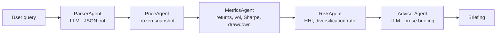
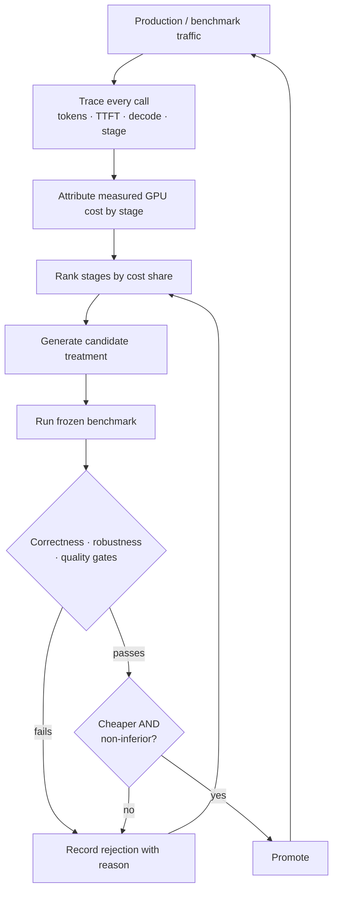

# Measuring, then reducing, the cost of a multi-agent LLM workflow

A financial-advisory agent workflow — natural-language portfolio question in,
written briefing out — served by **Llama-3.1-8B-Instruct** on **vLLM 0.27.1**,
single **A100 80GB PCIe**. This repository is the measurement harness, the two
optimizations that came out of the measurement, and the evidence for both.

```
                    cost/query    q/s    model    workflow   ticker   briefing
                   (per query    (C=8)   calls    failures   accuracy  topics
                    offered)             /query
  B0  baseline     $0.0001129    3.30    1.97      3.5%       95.3%    99.8%
  A1  cascade      $0.0000807    4.78    1.00      0.0%      100.0%    99.7%    −28.5%
  A2  + brevity    $0.0000692    5.58    1.00      0.0%      100.0%    99.3%    −38.7%
```

Median of **three repeats** per configuration, 1,000 queries each, all six runs
on one source-tree hash. Run-to-run spread: 0.3% (B0), 0.6% (A1), 0.3% (A2).

**Cheaper and more correct at the same time.** A1 removes 49% of model calls
and simultaneously takes ticker accuracy from 95.3% to 100% and workflow
failures from 3.5% to zero, because the failures *were* parser errors. That is
not the usual shape of a cost optimization, and it is the reason this
repository spends as much effort on quality gates as on cost.

One arm was **rejected**: a maximally terse Advisor prompt reached
$0.0000348/query (−69%) and is not in the table above, because it dropped the
diversification topic from 20% of briefings. Details in
[A2](#a2--advisor-brevity-under-quality-gates).

---

## The workflow

Five agents. Two call the model; three are deterministic Python.



A query such as *"40% Apple, 35% Microsoft and 25% Visa over the last year —
assess the risk"* is parsed into `{AAPL: 0.40, MSFT: 0.35, V: 0.25}` with a
365-day lookback, priced from a frozen snapshot, turned into per-ticker and
portfolio statistics, and written up by the Advisor.

Measured at B0, the two LLM stages are **99.7% of in-process time**. The three
deterministic agents together account for ~0.3%. So the cost question is
entirely a question about two model calls per query.

---

## Which part of the assessment is which

| Assessment part | Where it lives |
|---|---|
| **Systems** — stand up a workflow, model and inference server; run 100 queries; compute cost, cost/query, cost by agent, cost distribution, latency/throughput | [Systems](#systems-the-measurement-harness). Workload `systems_100` (100 queries), plus a C=1→64 concurrency sweep. |
| **Algorithms** — run 1,000 queries, compute metrics, improve cost efficiency, explain how to automate | [Baseline](#baseline-b0--what-1000-queries-revealed), [A1](#a1--deterministic-parser-cascade), [A2](#a2--advisor-brevity-under-quality-gates), [Automation](#automating-the-improvements). Workload `algorithms_1000` (1,000 queries). |

Both workloads are frozen id lists with checksums, and every run records the
SHA-256 of the query **text** it actually executed.

---

## Systems: the measurement harness

### Model

`meta-llama/Llama-3.1-8B-Instruct`, bfloat16, tensor-parallel size 1.

Chosen because it is open-weight, fits one A100 80GB without sharding (so
tensor-parallel communication is not a confound), and is a realistic size for
an agent workflow where the same model serves both a structured-extraction
stage and a prose-generation stage. That mismatch — one general model doing a
mechanical job and a creative one — is what A1 exploits.

### Inference server

vLLM 0.27.1, torch 2.13.0+cu130, Python 3.11.9.

```
vllm serve meta-llama/Llama-3.1-8B-Instruct \
  --port 8000 --dtype bfloat16 --tensor-parallel-size 1 \
  --max-model-len 8192 --gpu-memory-utilization 0.90 --seed 1337 \
  --no-enable-log-requests --no-enable-prefix-caching
```

| | |
|---|---|
| GPU | NVIDIA A100 80GB PCIe, driver 595.71.05, SM clock 1410 MHz, `CUDA_VISIBLE_DEVICES=0` |
| Prefix caching | **off**, deliberately — it is a separate optimization and would confound A1/A2 by caching the shared prompt prefix |
| Sampling | seed 1337, parser `temperature=0.0 max_tokens=200`, advisor `temperature=0.2 max_tokens=400` |
| Retries | max 3 attempts per call; official runs gate on **zero** failed model calls |
| Concurrency | 8 for headline runs; sweep covers 1–64 |

A fixed seed fixes sampling, not floating-point reduction order — vLLM batches
continuously, so the same prompt at a different batch size can still produce
different logits in the last bits. This shows up in the results and is
reported rather than hidden (see [baseline](#the-failure-set-is-stable-the-hallucination-is-not)).

### Workload

| Set | n | Used for |
|---|---|---|
| `systems_100` | 100 | Systems deliverable, C=1 attribution calibration, concurrency sweep |
| `algorithms_1000` | 1,000 | All headline B0 / A1 / A2 comparisons |

Both are explicit id lists with a checksum, frozen before measurement. Each run
records `query_set_id` (the id list), `query_content_sha256` (the query text as
executed) and `corpus_sha256` (the whole corpus file). The corpus itself is
**not** in this repository — see [Reproducibility](#reproducibility-note).

### Instrumentation

Every run emits a trace with one record per span, per LLM call and per query:

- per-call prompt / completion / cached-prompt tokens, TTFT, TPOT, latency,
  `finish_reason`
- per-agent inclusive **and exclusive** (`self_s`) time, so nested agents do not
  double-count
- GPU telemetry sampled over the measurement window, scoped to the devices the
  server was actually launched on
- workflow vs infrastructure failure classification
- parser correctness against shipped labels and derived labels
- Advisor quality (topic coverage, numeric grounding, truncation)
- price-source provenance for every read

### How total cost is measured, and why not the obvious way

**The obvious way is wrong.** Multiplying each request's latency by a GPU-hour
rate and summing overcounts by roughly the batch factor: under continuous
batching, many requests occupy the GPU *simultaneously*, so their wall-clock
times overlap. At C=8 that inflates cost by close to 8×.

What is measured instead:

```
total_usd = wall_clock(measurement window) × GPUs held × $/GPU-hour
```

One number, one multiplication, no model. The window starts after warm-up and
ends when the last query completes. The rate is pinned in
[`data/rate.json`](data/rate.json) — **$1.39/GPU-hour**, RunPod A100 PCIe 80GB
on-demand, retrieved 2026-08-22 — and `report.py` refuses to emit dollar
figures if the rate source is a placeholder.

The rate is called **rental-equivalent** throughout. The GPU was not rented;
presenting an opportunity cost as an incurred cost would be a lie that costs
nothing to avoid. Published rates for the same silicon span roughly 8× across
providers, which is why every stage comparison is quoted as a **ratio**.

Per-agent shares are a **separate, modelled** quantity —
see [Cost attribution](#cost-attribution-measured-total-modelled-split).

### Cost per query offered, not per query answered

Headline cost divides by queries **offered** (1,000), not answered.

Only B0 has failures, so only B0's denominator is in question. Dividing its GPU
time by its 965 successes instead raises its cost to $0.000117 and *enlarges*
every saving in the table (A1 becomes −31.0%, A2 −40.9%).

Per-attempted is the headline because it makes the claim **harder** to support,
and because the failure rate already has its own column — folding it into cost
as well counts it twice and turns "cheaper **and** more correct" into one fact
reported as two. `report.json` carries both, with `_headline_denominator`
naming which is which.

### Systems metrics, B0 at C=8 (n=1,000, rep6)

| | |
|---|---|
| Total measured cost | $0.113014 for the run |
| Cost / query offered | $0.0001130 |
| Throughput | 3.30 queries/s · 6.71 LLM calls/s · 1,870 prompt tok/s · 579 output tok/s |
| End-to-end latency | p50 2.376s · p90 2.900s · p95 3.040s · p99 3.334s |
| TTFT (all calls) | p50 0.053s · p95 0.079s · p99 0.096s |
| TPOT | p50 0.0132s · p95 0.0142s |
| Cost/query distribution | p50 $0.0001145 · p90 $0.0001393 · p99 $0.0001619 · min $0.0000152 · max $0.0001879 |

The cost distribution spans **12×** from cheapest to most expensive query — a
one-holding 30-day question against a six-holding five-year one. Dividing the
total evenly would hide exactly the structure the Systems prompt asks for.

### Concurrency sweep (`systems_100`, B0)

| C | 1 | 2 | 4 | 8 | 16 | 32 | 64 |
|---|--:|--:|--:|--:|--:|--:|--:|
| $/query | 0.000783 | 0.000407 | 0.000217 | 0.000115 | 0.0000701 | 0.0000495 | 0.0000398 |
| q/s | 0.48 | 0.93 | 1.74 | 3.24 | 5.39 | 7.56 | 9.53 |

**19.7× cheaper at C=64 than C=1**, replicated in both directions. Batching is
by far the largest single cost lever available, and it is free — which is why
the A1/A2 comparisons are all run at a fixed C=8 rather than being allowed to
drift. These sweep runs predate the provenance fields added later and are
reported as archived evidence (see [Historical evidence](#historical-evidence)).

---

## Baseline (B0) — what 1,000 queries revealed

Two things, one expected and one not.

### Cost is decode-dominated and parser-heavy

Fitted at C=1, one additional decode token costs **147×** what one additional
prefill token costs. The Advisor generates 128 tokens per query; the parser
generates 46 but reads 300. Attribution splits B0's measured cost:

| Stage | Calls | Prompt tok | Completion tok | Share of measured cost |
|---|--:|--:|--:|--:|
| AdvisorAgent | 965 | 247,662 | 123,331 | **72.0%** |
| ParserAgent | 1,000 | 299,713 | 46,220 | **28.0%** |

The parser is more than a quarter of the bill for a job that is almost entirely
mechanical: pull tickers, weights and a lookback out of a sentence.

### Operational success ≠ semantic correctness

**35 of 1,000 queries failed (3.5%), and every one was a parser error.**

| Failure class | n | What happened |
|---|--:|---|
| `SnapshotMiss` | 28 | Parser emitted a ticker outside the 30-symbol universe |
| `ParseError` | 7 | Model emitted invalid JSON — `{"KO": 1/3}`, `{"COST", 0.25}` |

The hallucinated tickers are instructive: **SFM** for *Salesforce* (correct:
CRM), **MCD** for *Mastercard* (correct: MA), **GOOG** where the universe holds
GOOGL, plus BABA, SQ, COKE, T and M. These are near-misses — plausible symbols
for the right kind of company.

That is the visible failure. The invisible one is worse: derived ticker accuracy
is **95.3%**, so roughly 47 queries per thousand had a wrong ticker set, but only
28 crashed. The rest produced a complete, confident, well-formed briefing
**about a portfolio the user did not ask for**. A benchmark that only counted
completions would have scored those as successes and reported the cost of
answering the wrong question, accurately.

Parser scoring therefore runs over **attempted** queries, not successful ones. A
parse error bad enough to crash the workflow is still a parse error, and
excluding it would make the metric most flattering exactly where the parser is
worst.

### The failure set is stable, the hallucination is not

Across reps 4–6 the failing query IDs are **identical** (set difference: empty),
but the specific hallucinated ticker sometimes differs — *Salesforce* resolved
to SFM 11 times in rep4 and 12 times in rep6. Reps 1–3, on earlier source
trees, failed 34 rather than 35.

So the baseline error rate is **3.4–3.5%**, near-deterministic in *which*
queries it affects and not quite deterministic in *what* it produces. That is
consistent with batch-size-dependent floating-point nondeterminism, and it is
reported as a range rather than as whichever single value reads better.

---

## A1 — deterministic parser cascade

### The insight

The workflow spends 28% of its budget asking an 8B general-purpose model to
perform structured extraction over a **closed 30-symbol universe**. Most of that
work is a lookup.

### What it is not

It is **not** "replace the LLM with a regex". The design rule is:

> Resolve only when the deterministic parser is confident. Otherwise decline and
> fall through to the original LLM parser, unchanged.

```
Query
  │
  ├─ lookback readable with confidence?  ── no ──┐
  │                                              │
  ├─ every capitalised entity resolvable?  ─ no ─┤
  │                                              │
  ├─ weights parse and sum to a portfolio? ─ no ─┤
  │                                              │
  └─ yes → structured parse, no model call       └─→ Tier 2: LLM parser (B0 path)
```

The asymmetry driving every rule: a **false decline** costs one LLM call and
degrades to exactly the baseline. A **false accept** silently analyses the wrong
portfolio, and its cost is unbounded.

### Tier 1 mechanics

- **Name index** built from provider metadata (`longName`/`shortName`) plus
  leading-prefix forms and unique ≥4-character tokens, so *Disney* reaches
  *The Walt Disney Company* and *JPMorgan* reaches *JP Morgan Chase & Co.*
- **Word-boundary matching** — `intel` must not match inside *intelligent*,
  `meta` inside *metadata*, `amazon` inside *amazonian*
- **Weight pairing by sequence adjacency**, not character distance. In
  `61% in Adobe, 14% in Costco`, the `14%` is physically *closer* to Adobe than
  `61%` is, because `% in ` sits between them; distance pairing transposed
  weights on 27% of the corpus while getting every ticker right — the worst
  failure shape available, since the answer stays plausible.
- **Weight-sum rule**: holdings must sum to 100% ±2pp, or decline. Normalising
  120/30 to 80/20 invents an intent nobody expressed. The band is 2pp rather
  than 1pp because `0.33 × 3` is `0.9899999…` in binary floating point.
- **Equal-weight detection** by structural pattern, not a phrase list.
- **Lookback**: both quantified (`18 months` → 545 days, the shipped label
  convention) and unquantified (`last month` → 30). An unreadable window
  declines rather than emitting `None`, because `None` would assert that the
  user stated no window.
- **Unknown-entity evidence**: a capitalised token that is not a resolvable
  holding forces a decline — including in clause-initial position, where
  capitalisation is normally grammar (`Rivian, AAPL and MSFT` must not resolve
  to `{AAPL: 0.5, MSFT: 0.5}`).
- **Universe check**: `GOOG` is a real ticker outside the snapshot. Dropping it
  is not an option and neither is guessing `GOOGL` — decline.

### A1 results (median of reps 4–6, n=1,000, C=8)

| | B0 | A1 | Δ |
|---|--:|--:|--:|
| Cost / query offered | $0.0001129 | **$0.0000807** | **−28.5%** |
| Model calls / query | 1.97 | 1.00 | −49.2% |
| Prompt tokens / query | 567.2 | 257.6 | −54.6% |
| Completion tokens / query | 175.7 | 127.4 | −27.5% |
| Total tokens / query | 742.9 | 385.0 | −48.2% |
| Tier-1 coverage | — | 1000/1000 | — |
| Workflow failures | 35 (3.5%) | **0** | — |
| Ticker accuracy (derived) | 95.3% | **100.0%** | +4.7pp |
| Weight accuracy (derived) | 94.3% | **100.0%** | +5.7pp |
| Holding-count accuracy (shipped label) | 99.0% | **100.0%** | +1.0pp |
| E2E latency p50 | 2.376s | 1.670s | −29.7% |
| Advisor topic coverage | 99.8% | 99.7% | −0.1pp |

Failures go to zero because the failures *were* the parser. The Advisor is
untouched, and its quality is unchanged.

### The attribution model predicted this before A1 ran

This is the strongest single piece of evidence that the cost model means
something:

1. B0 attribution assigned **28.0%** of measured cost to `ParserAgent`.
2. A1 removes that call entirely, so predicted A1 cost = total − parser share =
   **$0.081416**.
3. Measured A1 cost: **$0.080711**.
4. **Error: −0.87%.** Predicted saving 28.0%, observed saving 28.6%.

The observed cost came in slightly *below* prediction, which is the expected
direction — removing a request also removes its contribution to queueing.

A regression-derived split that predicts a real intervention to within a
percentage point is doing more than decorating a report.

---

## Robustness under distribution shift

100% accuracy on the evaluation corpus is **not** sufficient evidence for a
deterministic parser. Two of Tier 1's rules were written while watching it fail
on those very queries, so corpus accuracy is an upper bound measured on the
debugging set.

So there is a separate **91-query perturbed set**, built to attack routing
rather than coverage:

| Group | n | Probes |
|---|--:|---|
| A | 40 | Corpus phrasing, **all** entities outside the universe |
| B | 15 | Corpus phrasing, **one** entity outside the universe |
| C | 10 | Substring traps (`intel` in *intelligent*, `meta` in *metadata*) |
| D | 3 | Whole-word near-misses (company names that are ordinary English) |
| E | 4 | Partial weighting — ambiguous, must decline |
| F | 4 | Unreadable time windows — must decline |
| G | 15 | Unmodified corpus queries — must accept (control) |

Scored as two separate rates, because they are not equally bad:

| | Result |
|---|---|
| **False accepts** (Tier 1 answered where it should have deferred) | **1 / 91 = 1.1%** |
| **False declines** (deferred unnecessarily) | **0 / 91 = 0.0%** |

Earlier iterations of the routing rules failed several group-C and group-D
cases; the word-boundary guard and the weight-sum rule were written in response.
(The intermediate rates were not written to an artifact, so they are not quoted
here.)

**The one remaining false accept, stated rather than hidden:** group D,
*"an equal split of Adobe brick suppliers"* — Tier 1 resolves `Adobe` to ADBE.
*Adobe* is an ordinary English noun as well as a company name, and no
word-boundary rule distinguishes the two. Fixing it needs either
part-of-speech context or a curated ambiguity list; both were judged out of
scope, and the failure is documented instead.

`perturbed_set.py --score` is a **regression gate**, not a report: it exits
non-zero above a pinned budget of 1 false accept and 0 false declines. The
budget is pinned at the current measured state rather than at zero, because a
gate set below where the system actually is fails on day one and gets switched
off. What it catches is a *new* false accept.

The inputs are not published — group G is verbatim corpus text and groups A/B
reuse corpus sentence structure — but the composition and scores are, in
[`data/query_sets/perturbed.summary.json`](data/query_sets/perturbed.summary.json).

---

## A2 — Advisor brevity, under quality gates

With the parser gone, the Advisor is 100% of remaining model cost.

### Diagnosis before intervention

The trace already carried `finish_reason` per call. **Zero briefings hit the
400-token ceiling** at B0 — the cap was not binding, so lowering `max_tokens`
would have truncated mid-sentence rather than made the model concise. The
intervention had to be in the *instruction*, not the limit.

`max_tokens` stayed at 400 in every arm, so a shorter briefing means the model
chose to write less rather than being cut off. That is a testable distinction,
and `advisor_no_truncation` tests it.

### Arms

| Arm | Instruction | Words | Sentences |
|---|---|--:|--:|
| `handout` | as shipped | 78 | 3.5 |
| `short` | shorter, all four topics required | 65 | 2.0 |
| `terse` | maximally compressed | 28 | 1.0 |

### Quality gates

Three mechanical, deterministic checks — no model in the loop, because a
model-based judge would make the quality gate a cost centre and put a second
nondeterministic component inside the measurement:

1. **Truncation** — `finish_reason` must never be `length`.
2. **Topic coverage** — the shipped prompt asks for return, risk,
   diversification and concentration. Brevity that drops a topic has changed the
   deliverable, not compressed it.
3. **Numeric grounding** — every figure in the prose must be within rounding
   distance of something the workflow computed. A model under pressure to be
   brief can drop specifics; it can also invent them.

Each is a **non-inferiority** test against a declared reference arm, with
margins fixed before the arms ran (truncation 0.0, topics 2pp, grounding 2pp).

### The terse arm was rejected

| | A1 (reference) | A2-short | A2-terse |
|---|--:|--:|--:|
| Cost / query offered | $0.0000807 | **$0.0000692** | $0.0000348 |
| vs B0 | −28.5% | **−38.7%** | −69.2% |
| Words / briefing | 78 | 65 | 28 |
| **All four topics** | 99.7% | **99.3%** ✓ | **76.6%** ✗ |
| Numeric grounding (pooled) | 98.8% | **99.5%** ✓ | 99.7% |
| Truncated | 0% | 0% | 0% |

Terse was by far the cheapest arm and it is **not in the headline table**. The
failure is specific, not a threshold trip:

| Topic | return | risk | diversification | concentration |
|---|--:|--:|--:|--:|
| terse coverage | 99.9% | 100% | **80.1%** | 96.5% |

A one-sentence briefing has room for three of the four required topics, and it
reliably sheds the same one. The objective was never "minimise tokens" — it was
"minimise cost subject to quality holding", and terse fails that constraint at
the gate, in code, not by my judgement.

### A2-short is accepted, and it improves grounding

The result that was not expected: asking for a shorter briefing made the model
**invent fewer numbers**.

| | B0 | A1 | A2-short |
|---|--:|--:|--:|
| Briefings containing ≥1 ungrounded figure | 6.9% | 6.0% | **2.5%** |
| Grounded fraction (pooled over all figures) | 98.6% | 98.8% | **99.5%** |
| Figures per briefing | 5.9 | 5.9 | 5.4 |

Figures per briefing barely moved, so this is not an artifact of having fewer
opportunities to be wrong. Brevity was supposed to cost quality; the gate that
existed to price that cost found the opposite sign.

---

## Final results

All values are **medians of three repeats**, 1,000 queries each, C=8, one
source-tree hash, `algorithms_1000` workload, on the hardware and server
configuration above.

| Configuration | $/query offered | Δ vs B0 | $/query answered | Model calls/query | Tokens/query | Workflow failures | Ticker accuracy | Topics | Grounding | Verdict |
|---|--:|--:|--:|--:|--:|--:|--:|--:|--:|---|
| **B0** baseline | $0.0001129 | — | $0.0001170 | 1.97 | 743 | 3.5% | 95.3% | 99.8% | 98.6% | reference |
| **A1** cascade | $0.0000807 | **−28.5%** | $0.0000807 | 1.00 | 385 | 0.0% | 100.0% | 99.7% | 98.8% | **accepted** |
| **A1+A2-short** | $0.0000692 | **−38.7%** | $0.0000692 | 1.00 | 363 | 0.0% | 100.0% | 99.3% | 99.5% | **accepted** |
| A1+A2-terse | $0.0000348 | −69.2% | $0.0000348 | 1.00 | 300 | 0.0% | 100.0% | **76.6%** | 99.7% | **rejected** — topic coverage |

Rejected on measurement elsewhere in the project, kept in `results/`:

| Candidate | Why rejected |
|---|---|
| A2-terse | Drops diversification from 20% of briefings |
| A3 memoisation | Repeated-query rate under 0.5% of self-time; no measurable win |
| A4 parser distillation | A1's Tier 1 already covers 1000/1000, leaving 0 queries for a distilled fallback to serve |

Using per-answered cost instead would give −31.0% and −40.9%. The smaller,
harder-to-support numbers are the headline.

---

## Cost attribution: measured total, modelled split

**The total is measured. The split is modelled. The two are never conflated.**

Per-agent cost cannot be metered directly — the GPU does not bill by caller. So
attribution is a fitted model, and it is labelled as one everywhere it appears.

### Method

Two regressions, fitted on a dedicated **C=1 calibration run** where measured
times contain no queueing delay:

```
TTFT             ~ alpha + a · prompt_tokens
latency − TTFT   ~ beta  + b · (completion_tokens − 1)
```

The intercepts matter. Even at C=1 a request carries HTTP overhead, scheduler
dispatch and stream teardown; folding that into a per-token slope — as a single
`latency ~ a·prefill + b·decode` fit does — inflates both coefficients, and
inflates them unequally, worst for short requests.

Fitted values (calibration `B0cal-offline-n100-c1-rep4`, 196 calls):

| | |
|---|--:|
| Marginal prefill | 7.885e-05 s/token |
| Marginal decode | 1.161e-02 s/token |
| **Decode : prefill ratio** | **147×** |
| Fixed request overhead | 1.650e-02 s |
| R² prefill / decode | 0.658 / 0.99992 |
| Degenerate | false |

The measured total is then divided in proportion to each stage's fitted token
work, including its share of fixed per-request overhead.

### Sanity gates

- A slope ≤ 0 is **fatal** — it means the data contradicts the model, and
  clamping it to a small positive would publish "tokens are free".
- Weak R² and unidentifiable slopes are recorded in the artifact and printed,
  not refused; decode timing at C=1 is genuinely noisy and a gate that fires on
  honest noise is one people learn to bypass.
- Raw (pre-clamp) coefficients travel with the weights.
- `--weights-from` **fails closed**: a calibration with no usable trace, a
  different model, snapshot, prefix-caching setting, GPU set, or a
  non-C=1 concurrency is refused, and the full server configuration is compared
  by fingerprint (vLLM version, dtype, TP, KV budget, GPU model, driver).

### Validated against a real intervention

Attribution predicted A1's cost to **within 0.9%** before A1 was measured
([above](#the-attribution-model-predicted-this-before-a1-ran)). Attribution is
used for *targeting* — deciding what to optimize — while every headline dollar
figure comes from the measured GPU window.

---

## Experimental validity

A run is not a result until it proves what it did. Before this harness existed,
the supplied workflow could complete a 1,000-query sweep **without ever
contacting a model** — with `boto3` missing it returns a well-formed result
whose briefing is a hardcoded template. That is the failure mode every check
below exists to make impossible.

Checks have **three** outcomes, not two:

| | Meaning |
|---|---|
| **PASS** | verified from evidence present at check time |
| **FAIL** | verified to be wrong — the run is not reportable |
| **GAP** | the evidence is not available here. Gates nothing, counts as nothing, and is never reported as a pass |

The third state exists because collapsing it into "pass" produced a lie: a
re-check that could not see `results.jsonl` was handed placeholder rows, found
zero bad price reads among zero reads, and wrote *"all reads from snapshot"*
into published artifacts. An empty set satisfies any universal claim.

### Workload identity
`query_set_id` (frozen id list) · `query_content_sha256` (the query text as
executed) · `corpus_sha256` · query set verified against its checksum before
the run starts.

### Model and server identity
Requested model matches the declared model · the **live** server is probed for
what it advertises · the live process `/proc` command line is compared to the
launch record **in full**, flag by flag, not against a handpicked list · GPU
telemetry is scoped to the devices the server was given · prefix caching must
match what the stage requires, not merely be recorded.

### Measurement integrity
Price snapshot re-hashed file-by-file before the run · every price read
verified to come from the snapshot · synthetic test fixtures rejected by
provenance, so a smoke run can never pass as a measurement · zero
infrastructure failures · zero failed model calls (a retried call still spent
measured wall-clock) · every worker warmed before the clock starts, with
failures aborting the run rather than being swallowed · warm-up traced under
`warmup-*` ids and excluded by name.

### Quality and scorer integrity
Parser scoring is **required**, though its accuracy is reported rather than
gated · the alias map (`vocab.json`) and both scorer modules are hashed into
the artifacts they produce · two quality scores are comparable only if their
scorer hashes match, and the harness refuses to render a verdict across
different ones · rows whose query text is unavailable are counted and gated,
because excluding them would drop the parser's own errors from its accuracy.

### Cross-run comparability
`source_tree_sha256` over every `.py`/`.sh` that could change a number · an A2
arm must bind to its reference by model, snapshot, query content and workload
size, not merely by path · `compare_runs.py` checks that the runs behind the
headline table differ **only** in the named treatment · `--repeats` is stricter
still, requiring an identical source tree, because a median over three repeats
claims they are three samples of one system.

### Historical evidence

`results/` contains 30+ runs, and **rejected and superseded runs are kept**:

- **A2-terse** — rejected on quality. Deleting the arm that failed the gate is
  how a results directory becomes a highlight reel.
- **Three early A1 runs at n=100** — these FAIL `cascade_saw_every_query` under
  current rules, and `recheck_runs.py` diagnoses why: their Tier-1 counts exceed
  attempted queries by exactly the warm-up count, which is the warm-up-leak bug
  that `reset_parser_stats()` fixed. The check works; the runs are superseded.
- **Pre-audit runs** (`rep1`/`rep2` of several arms) — these predate
  `query_content_sha256`, `source_tree_sha256` and the template-fallback
  provenance field. `compare_runs.py` returns **CANNOT ESTABLISH** on them, not
  because they differ from the newer runs but because the artifacts cannot
  prove they do not. They are retained as evidence and excluded from the
  headline.

`scripts/recheck_runs.py` re-judges every archived run under today's rules and
writes `validity.recheck.json` beside each one, so "passed validity" is never
silently upgraded from "passed the rules of the day".
[`results/INDEX.md`](results/INDEX.md) is generated from the artifacts and lists
every run under one of three headings: behind published numbers, rejected on
measurement, or superseded.

---

## Automating the improvements

The assessment asks how these improvements could be automated. Both are
instances of one loop, and most of it is already built.



The harness already implements trace → attribute → rank → gate → compare. What
is manual today is candidate generation and promotion.

### Parser learning loop (closes A1's remaining gap)

Tier 1 declines on an unknown company. That decline is logged with its evidence
token. So:

1. Tier 2 (the LLM) resolves the query and produces a company → ticker mapping.
2. The mapping is **validated against an authoritative symbol source** and must
   agree across N independent resolutions.
3. It is checked against the ambiguity rules — a candidate that is also an
   ordinary English word (the *Adobe* case) is flagged for review rather than
   auto-accepted.
4. Only then is it added to the name table, which is content-hashed into every
   subsequent run's manifest.
5. Future queries mentioning that company skip the model entirely.

Coverage rises over time and the cost curve follows, without the failure mode
of letting a model's output silently mutate a deterministic lookup table. The
validation step is the whole design: an unvalidated auto-added alias converts a
false decline (costs one call) into a permanent false accept (costs a wrong
answer, forever).

### Continuous optimization

Everything below plugs into the same gate chain, since the expensive part —
deciding whether a cheaper thing is still correct — already exists:

- **Periodic re-ranking** — re-run attribution on recent traffic; the most
  expensive stage is the next candidate.
- **Prompt/config search** — the A2 arms were three points in a space a script
  could enumerate, each auto-rejected on topic coverage or grounding.
- **Deterministic-rule regression** — `eval_cascade.py` (holdings *and*
  lookback) and `perturbed_set.py --score` (pinned false-accept budget) already
  exit non-zero on regression, so any rule change is CI-gateable.
- **Model routing** — route by predicted difficulty to a smaller model, gated
  on the same quality checks.
- **Quantization / speculative decoding** — decode costs 147× prefill per
  token, so anything that raises decode throughput is the highest-leverage
  server-side change available; each is a treatment the harness can price.
- **Prefix caching** — deliberately off here to avoid confounding A1/A2; the
  shared system prompt is a large cached-prefix opportunity, and the cost model
  already accounts for cached prompt tokens separately.
- **Concurrency tuning** — the sweep shows 19.7× between C=1 and C=64; the
  same script can find the knee against an SLO.

### Promotion policy

Automation is only safe with an explicit promotion rule, which this repository
implements: **promote only if cheaper AND non-inferior on every declared gate,
measured against a reference bound to the same experiment.** A2-terse is the
worked example — 69% cheaper, automatically rejected.

---

## Repository structure

```
agentops/            measurement library
  trace.py             span / LLM-call / query records
  instrument.py        agent boundary instrumentation
  llm.py               OpenAI-compatible client, token + TTFT capture
  cost.py              GpuRate, AllocatedCost, weight fitting, attribution
  validity.py          RunManifest, check_run, comparability, fingerprints
  preflight.py         snapshot verification, live-server + argv probing
  parser_eval.py       parser correctness (shipped + derived labels)
  advisor_eval.py      briefing quality gates
  gpu.py               scoped nvidia-smi sampling

workflow/
  pipeline.py                     instrumented pipeline wrapper
  portfolio/agents/
    parser_agent.py                 B0 LLM parser (new)
    parser_cascade.py               A1 Tier-1 deterministic parser (new)
    {price,metrics,risk,advisor}_agent.py   supplied, patched (see PATCHES.md)

scripts/
  run_bench.py         the benchmark driver
  report.py            run directory -> metrics
  eval_cascade.py      offline Tier-1 coverage + correctness gate
  perturbed_set.py     robustness set: build + regression gate
  compare_runs.py      is this comparison / repeat set valid at all
  recheck_runs.py      re-judge archived runs under current rules
  rescore_{parser,advisor}.py   re-score all runs with one ruler
  results_index.py     generate results/INDEX.md
  smoke_test.py        full harness check, no GPU or network
  pre_commit_audit.sh  what would be committed, and does it leak
  history_audit.sh     the same question about git history
  serve_vllm.sh        launch vLLM and record the launch
  build_snapshot.py    freeze the price snapshot

data/
  rate.json            the GPU rate every dollar figure derives from
  vocab.json           alias map (hashed into parser_eval.json)
  names.json           A1 name table (hashed into the manifest)
  query_sets/          systems_100, algorithms_1000, perturbed.summary
  snapshot/            frozen prices (MANIFEST.json published, data not)

results/               every run, including rejected and superseded ones
  INDEX.md               generated map of what each run is
METHODS.md             measurement methodology in detail
PATCHES.md             every change made to the supplied workflow
```

---

## Reproducing

### Reproducibility note — read first

**This repository is deliberately not standalone.** It excludes the supplied
workflow source and the query corpus, because publishing an employer's take-home
would leak it for every future candidate and it is not mine to republish.

Required and missing:

```
workflow/portfolio/agents/{price,metrics,risk,advisor}_agent.py
workflow/portfolio/workflows/portfolio_workflow.py
data/queries.json
```

`PATCHES.md` documents every change made to those files without reproducing
them. `parser_agent.py` and `parser_cascade.py` **are** included — both are new
stages written for this project.

Also excluded: the frozen price snapshot (provider data — `MANIFEST.json` with
per-ticker checksums is kept, so a rebuilt snapshot can be *proved* identical),
vLLM logs, raw per-query traces, and the perturbed robustness inputs.

### Commands

`make` and `./run.sh` expose the same targets; the lab node had no `make`.

```bash
# 0. setup
./scripts/bootstrap.sh

# 1. harness check — no GPU, no network, ~40s. Includes ~90 regression checks.
python scripts/smoke_test.py

# 2. freeze the price snapshot (once)
python scripts/build_snapshot.py

# 3. serve (prefix caching off)
./scripts/serve_vllm.sh

# 4. offline Tier-1 check before spending GPU time
python scripts/eval_cascade.py          # exits non-zero on any disagreement

# 5. attribution calibration at C=1
python scripts/run_bench.py --stage B0cal --concurrency 1 \
  --query-set data/query_sets/systems_100.json --expect-apc off --repeat 1

# 6. the three arms, n=1000, C=8
python scripts/run_bench.py --stage B0 --concurrency 8 \
  --query-set data/query_sets/algorithms_1000.json --expect-apc off --repeat 1
python scripts/run_bench.py --stage A1 --concurrency 8 \
  --query-set data/query_sets/algorithms_1000.json --expect-apc off --repeat 1
python scripts/run_bench.py --stage A2-short --concurrency 8 \
  --query-set data/query_sets/algorithms_1000.json --expect-apc off --repeat 1 \
  --advisor-reference results/A1-offline-n1000-c8-rep1

# 7. reports, weighted from the C=1 calibration
python scripts/report.py results/B0-offline-n1000-c8-rep1 \
  --weights-from results/B0cal-offline-n100-c1-rep1

# 8. robustness gate
python scripts/perturbed_set.py --build
python scripts/perturbed_set.py --score     # exits non-zero above the budget

# 9. is the comparison valid at all
python scripts/compare_runs.py --headline
python scripts/compare_runs.py results/B0-offline-n1000-c8-rep{1,2,3} --repeats

# 10. re-judge everything and regenerate the index
./run.sh recheck
```

`--stage` is binding, not a label: `--stage A1 --parser llm` is refused, and a
stage that changes the Advisor must declare the reference run it claims to
match.

---

## Design decisions

**Why deterministic parsing rather than fine-tuning?**
The parser's job is extraction over a closed 30-symbol universe — structured
enough that a high-confidence fast path removes the inference entirely rather
than making it cheaper. Fine-tuning would still pay for a forward pass per
query, still be a model that can hallucinate a ticker, and would need its own
training and evaluation pipeline. It remains the right answer for the *residual*
— queries Tier 1 declines — which is why the LLM path is preserved.

**Why keep the LLM fallback at all, given 1000/1000 coverage?**
Because 1000/1000 is measured on the corpus two of Tier 1's rules were tuned
against. The robustness set exists because that number cannot be trusted alone,
and the fallback is what makes a false decline cost one call instead of a wrong
answer.

**Why not just lower `max_tokens`?**
Because the trace showed the cap was never binding — zero briefings finished on
`length`. Lowering it would have truncated mid-sentence. The binding constraint
was the instruction, so the instruction is what changed.

**Why per-attempted cost as the headline?**
It is the denominator that makes the improvement look *smaller*, and the failure
rate is already its own column. Both figures are in every `report.json`.

**Why measure a GPU window instead of summing request latencies?**
Continuous batching shares the GPU across concurrent requests; summing their
wall times overcounts by roughly the batch factor.

**Why keep rejected and superseded runs?**
Because a results directory containing only successes is not evidence, and
because each failing run demonstrates a guard that catches something real.

**Why three states for validity checks?**
Because "cannot tell" is not "fine". Collapsing it produced a published artifact
asserting that price reads came from the snapshot in a re-check that had read
none.

---

## Limitations

- **One workload distribution.** `algorithms_1000` and the 91-query perturbed
  set come from one corpus over a 30-symbol universe. Tier-1 behaviour on
  genuinely open-domain financial language is untested.
- **A deterministic parser cannot be proved correct on natural language.** The
  robustness set raises confidence; it does not establish generality. One known
  false accept remains (*Adobe*).
- **Per-agent attribution is modelled, not metered.** It predicted A1 to within
  0.9%, which is evidence it is useful — not evidence it is exact.
- **Three repeats per arm, one hardware configuration, one session.** Enough to
  show run-to-run spread under 1%; not enough for a confidence interval, and
  no claim of statistical significance is made. Between-session and
  between-GPU variance is unmeasured.
- **The concurrency sweep and several early runs predate the provenance
  fields.** They are reported as archived evidence and marked CANNOT ESTABLISH
  by the comparison tooling.
- **Numeric grounding is value-level, not semantic.** A correct number attached
  to the wrong concept would pass.
- **Results are specific to this model, server version, GPU and settings.**
  Prefix caching is off by choice; every dollar figure is one multiplication
  from another provider's rate.
- **Untested optimizations remain**, several of them probably larger than A2 —
  see below.

---

## Future work

- **Prefix caching** — the shared system prompt is a substantial cached-prefix
  opportunity, deliberately excluded here to avoid confounding A1/A2. The cost
  model already tracks cached prompt tokens separately.
- **Quantization (FP8/AWQ) and speculative decoding** — decode costs 147× a
  prefill token, so decode throughput is the highest-leverage server-side lever.
- **Smaller-model routing** for the Advisor, gated on the existing
  non-inferiority checks.
- **Validated name-table learning**, closing the Tier-1 coverage loop
  automatically with the review step described above.
- **Automated Pareto search** over cost against the quality gates, rather than
  three hand-chosen Advisor arms.
- **Expanded robustness corpus**, particularly ambiguity cases of the *Adobe*
  class.
- **Multi-session, multi-GPU replication** for real confidence intervals.

---

## Rate

All dollar figures use **$1.39/GPU-hour**, RunPod A100 PCIe 80GB on-demand,
retrieved 2026-08-22, pinned in [`data/rate.json`](data/rate.json). Called
*rental-equivalent* throughout: the GPU was not rented, and presenting an
opportunity cost as an incurred cost would be a lie that costs nothing to avoid.
Published rates for the same silicon span roughly 8× across providers, so every
figure here is one multiplication from any other provider's — which is why stage
comparisons are quoted as ratios.
