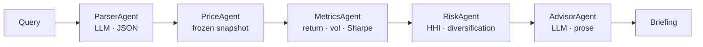

# Measuring, then reducing, the cost of a multi-agent LLM workflow

A financial-advisory agent workflow — portfolio question in, written briefing
out — served by **Llama-3.1-8B-Instruct** on **vLLM 0.27.1**, one **A100 80GB
PCIe**. This is the measurement harness, two optimizations that came out of the
measurement, and the evidence for both.

```
                   cost/query    q/s    model    workflow   ticker   briefing
                  (per query    (C=8)   calls    failures   accuracy  topics
                   offered)             /query
  B0  baseline    $0.0001129    3.30    1.97      3.5%       95.3%    99.8%
  A1  cascade     $0.0000807    4.78    1.00      0.0%      100.0%    99.7%   −28.5%
  A2  + brevity   $0.0000692    5.58    1.00      0.0%      100.0%    99.3%   −38.7%
```

Median of **three repeats** per arm, 1,000 queries each, all on one source-tree
hash; spread 0.3% / 0.6% / 0.3%.

**Cheaper and more correct at once.** A1 halves model calls *and* takes ticker
accuracy from 95.3% to 100% with failures from 3.5% to zero — because the
failures *were* parser errors. A third arm was **rejected**: a maximally terse
Advisor reached −69% but dropped a required topic from 20% of briefings.

Depth: [`METHODS.md`](METHODS.md). Every run: [`results/INDEX.md`](results/INDEX.md).

**Systems** (serve a workflow, 100 queries, cost / cost-per-query / cost by
agent / distribution / throughput) is [Systems](#systems), on `systems_100` plus
a C=1→64 sweep. **Algorithms** (1,000 queries, improve cost efficiency, explain
automation) is [Baseline](#baseline-b0) → [A1](#a1--deterministic-parser-cascade)
→ [A2](#a2--advisor-brevity-under-gates) → [Automation](#automating-the-improvements),
on `algorithms_1000`.

## The workflow



*"40% Apple, 35% Microsoft and 25% Visa over the last year — assess the risk"*
becomes `{AAPL: .40, MSFT: .35, V: .25}` at 365 days, priced from a frozen
snapshot, then written up. Two of the five agents call the model and account for
**99.7% of in-process time**, so cost is entirely a question about two calls per
query.

## Systems

**Model** `meta-llama/Llama-3.1-8B-Instruct`, bfloat16, TP=1 — open-weight, fits
one A100 unsharded (so TP communication is not a confound), and realistically
sized for a workflow where one model does both structured extraction and prose.
That mismatch is what A1 exploits.

```
vllm serve meta-llama/Llama-3.1-8B-Instruct --port 8000 --dtype bfloat16 \
  --tensor-parallel-size 1 --max-model-len 8192 --gpu-memory-utilization 0.90 \
  --seed 1337 --no-enable-log-requests --no-enable-prefix-caching
```

A100 80GB PCIe, driver 595.71.05, `CUDA_VISIBLE_DEVICES=0`. Prefix caching
**off** by choice — a separate optimization that would confound A1/A2 by caching
the shared prefix. Parser `temp=0.0 max_tokens=200`, Advisor `temp=0.2
max_tokens=400`, seed 1337, C=8 for headline runs. A fixed seed fixes sampling,
not floating-point reduction order: vLLM batches continuously, so the same
prompt at a different batch size can differ in the last bits. That shows up in
the results and is reported.

**Workload** `systems_100` (100 queries) and `algorithms_1000` (1,000) — frozen
id lists with checksums. Each run records the id-list hash, the SHA-256 of the
query **text as executed**, and the corpus hash. The corpus is not published
(see [Reproducing](#reproducing)).

**Instrumentation** captures per-call tokens / TTFT / TPOT / latency /
`finish_reason`, per-agent inclusive **and exclusive** time (so nested agents
don't double-count), scoped GPU telemetry, failure classification, parser
correctness, Advisor quality, and price-source provenance on every read.

### How cost is measured, and why not the obvious way

Multiplying each request's latency by a GPU-hour rate and summing **overcounts
by roughly the batch factor** — under continuous batching many requests hold the
GPU at once, so their wall times overlap. At C=8 that inflates cost ~8×. Instead:

```
total_usd = wall_clock(measurement window) × GPUs held × $/GPU-hour
```

One measurement, one multiplication, no model. The rate is pinned in
[`data/rate.json`](data/rate.json) — **$1.39/GPU-hour**, RunPod A100 PCIe 80GB,
retrieved 2026-08-22 — and `report.py` refuses to emit dollars if the source is
a placeholder. It is called *rental-equivalent*: the GPU was not rented, and
presenting an opportunity cost as an incurred cost would be a lie that costs
nothing to avoid. Provider rates span ~8×, so stage comparisons are quoted as
ratios. Per-agent shares are a **separate modelled** quantity — see
[Attribution](#attribution-measured-total-modelled-split).

**Denominator.** Headline cost divides by queries *offered*, not answered. Only
B0 has failures, so only B0 moves: per-answered raises it to $0.000117 and
*enlarges* every saving (A1 −31.0%, A2 −40.9%). Per-offered is the headline
because it makes the claim harder to support, and the failure rate already has
its own column. Both are in every `report.json`.

### B0 systems metrics (C=8, n=1,000) and the concurrency sweep

Total measured $0.113014 · $0.0001130/query · 3.30 q/s · 1,870 prompt tok/s ·
579 output tok/s. E2E latency p50 2.376s, p90 2.900s, p99 3.334s; TTFT p50
0.053s, TPOT p50 0.0132s. The cost-per-query distribution runs p50 $0.0001145 →
p99 $0.0001619, min $0.0000152 → max $0.0001879 — a **12× spread**, a
one-holding 30-day query against a six-holding five-year one. Dividing the total
evenly would hide exactly the structure the prompt asks for.

| C | 1 | 2 | 4 | 8 | 16 | 32 | 64 |
|---|--:|--:|--:|--:|--:|--:|--:|
| $/query | 0.000783 | 0.000407 | 0.000217 | 0.000115 | 0.0000701 | 0.0000495 | 0.0000398 |
| q/s | 0.48 | 0.93 | 1.74 | 3.24 | 5.39 | 7.56 | 9.53 |

**19.7× cheaper at C=64 than C=1** — batching is the largest single lever and it
is free, which is why every A1/A2 comparison is pinned at C=8. (These runs
predate the provenance fields and are archived evidence.)

## Baseline (B0)

**Cost is decode-dominated and parser-heavy.** One decode token costs **147×** a
prefill token (fitted at C=1). Attribution splits the measured total:

| Stage | Calls | Prompt tok | Completion tok | Share of measured cost |
|---|--:|--:|--:|--:|
| AdvisorAgent | 965 | 247,662 | 123,331 | **72.0%** |
| ParserAgent | 1,000 | 299,713 | 46,220 | **28.0%** |

A quarter of the bill goes to a mechanical job: pull tickers, weights and a
lookback out of a sentence.

**Operational success ≠ semantic correctness.** 35 of 1,000 queries failed
(3.5%), and every one was a parser error — 28 `SnapshotMiss` (ticker outside the
30-symbol universe) and 7 `ParseError` (invalid JSON like `{"KO": 1/3}`). The
hallucinations are near-misses: **SFM** for *Salesforce* (correct CRM), **MCD**
for *Mastercard* (correct MA), **GOOG** where the universe holds GOOGL, plus
BABA, SQ, COKE, T, M.

That is the visible failure. The invisible one is worse: derived ticker accuracy
is **95.3%**, so ~47 queries per thousand had a wrong ticker set but only 28
crashed. The rest produced a complete, confident briefing **about a portfolio
nobody asked for** — a benchmark counting completions would have scored those as
successes and accurately reported the cost of answering the wrong question.
Parser accuracy is therefore scored over **attempted** queries; excluding the
crashes would flatter the metric exactly where the parser is worst.

Across reps 4–6 the failing query IDs are **identical** while the hallucinated
ticker sometimes differs, and reps 1–3 on earlier trees failed 34 rather than
35. So the error rate is **3.4–3.5%** — near-deterministic in *which* queries,
not quite in *what* they produce. Consistent with batch-size nondeterminism, and
reported as a range rather than whichever value reads better.

## A1 — deterministic parser cascade

28% of the budget asks an 8B general model to do structured extraction over a
**closed 30-symbol universe**. Most of that is a lookup. This is not "replace
the LLM with a regex" — the rule is:

> Resolve only when the deterministic parser is confident. Otherwise decline and
> fall through to the original LLM parser, unchanged.

```
Query ─┬─ lookback readable?          ─ no ─┐
       ├─ every entity resolvable?    ─ no ─┤
       ├─ weights sum to a portfolio? ─ no ─┤
       └─ yes → structured parse             └─→ Tier 2: LLM parser (B0 path)
             (no model call)
```

The asymmetry behind every rule: a **false decline** costs one LLM call and
degrades to exactly the baseline; a **false accept** silently analyses the wrong
portfolio, at unbounded cost.

Tier 1 builds a name index from provider metadata plus prefix forms and unique
≥4-char tokens (*Disney* → *The Walt Disney Company*); matches on word
boundaries (`intel` must not fire inside *intelligent*); pairs weights by
**sequence adjacency, not character distance** — in `61% in Adobe, 14% in
Costco` the `14%` is physically closer to Adobe, and distance pairing transposed
weights on 27% of the corpus while getting every ticker right; requires weights
to sum to 100% ±2pp; and declines on any unresolvable capitalised token,
including clause-initial ones where capitalisation is normally grammar.

Median of reps 4–6: cost **−28.5%**, model calls 1.97 → 1.00 (**−49.2%**),
tokens 743 → 385 (**−48.2%**), Tier-1 coverage **1000/1000**, workflow failures
35 → **0**, ticker accuracy 95.3% → **100%**, weight accuracy 94.3% → **100%**,
E2E p50 2.376s → 1.670s (−29.7%), Advisor topic coverage unchanged at 99.7%.

### The cost model predicted this before A1 ran

B0 attribution assigned **28.0%** of measured cost to `ParserAgent`. A1 removes
that call, so predicted A1 cost = total − parser = **$0.081416**. Measured:
**$0.080711** — an error of **−0.87%**, predicted saving 28.0% against observed
28.6%. Slightly *below* prediction, the right direction, since removing a
request also removes its queueing contribution. A regression-derived split that
predicts a real intervention to within a point is doing more than decorating a
report.

## Robustness

100% on the evaluation corpus is **not** sufficient evidence: two Tier-1 rules
were written while watching it fail on those queries, so corpus accuracy is an
upper bound measured on the debugging set. A separate **91-query perturbed set**
attacks routing rather than coverage — out-of-universe entities in corpus
phrasing (55), substring traps (10), whole-word near-misses (3), ambiguous
partial weights (4), unreadable windows (4), and 15 unmodified corpus queries as
controls. Result: **1/91 false accepts (1.1%)** — answered where it should have
deferred — and **0/91 false declines**. Earlier iterations failed several
substring and near-miss cases; the word-boundary guard and weight-sum rule were
written in response. (Intermediate rates were never written to an artifact, so
they are not quoted.)

**The one remaining false accept, stated not hidden:** *"an equal split of Adobe
brick suppliers"* — Tier 1 resolves `Adobe` to ADBE. *Adobe* is an ordinary
English noun as well as a company, and no word-boundary rule separates them.
Fixing it needs part-of-speech context or a curated ambiguity list; both were out
of scope. `perturbed_set.py --score` is a **regression gate**, exiting non-zero
above a pinned budget of 1 false accept and 0 false declines — pinned at the
current state rather than zero, because a gate set below where the system is
fails on day one and gets switched off. What it catches is a *new* false accept.

## A2 — Advisor brevity, under gates

With the parser gone, the Advisor is 100% of remaining model cost.

**Diagnosis before intervention.** The trace already carried `finish_reason`:
**zero briefings hit the 400-token ceiling**, so the cap was not binding and
lowering `max_tokens` would have truncated mid-sentence rather than induced
concision. The instruction was the binding constraint, so the instruction
changed — and `max_tokens` stayed at 400 in every arm, so a shorter briefing
means the model chose to write less.

Three deterministic gates, no model in the loop (a model judge would make the
quality gate a cost centre and add a second nondeterministic component inside the
measurement): **truncation**, **topic coverage** (return, risk, diversification,
concentration), and **numeric grounding** (every figure within rounding distance
of something the workflow computed). Each is a non-inferiority test against a
declared reference, margins fixed before the arms ran.

| | A1 (ref) | A2-short | A2-terse |
|---|--:|--:|--:|
| Cost / query · vs B0 | $0.0000807 · −28.5% | **$0.0000692 · −38.7%** | $0.0000348 · −69.2% |
| Words / briefing | 78 | 65 | 28 |
| **All four topics** | 99.7% | **99.3%** ✓ | **76.6%** ✗ |
| Grounding (pooled) | 98.8% | **99.5%** ✓ | 99.7% |
| Truncated | 0% | 0% | 0% |

**Terse was the cheapest arm and is rejected.** The failure is specific, not a
threshold trip — return 99.9%, risk 100%, concentration 96.5%, but
**diversification 80.1%**. A one-sentence briefing has room for three of four
required topics and reliably sheds the same one. The objective was never
"minimise tokens" but "minimise cost subject to quality holding", and terse fails
that in code, at the gate.

**The unexpected result:** asking for a shorter briefing made the model **invent
fewer numbers** — briefings containing at least one ungrounded figure fell from
6.9% (B0) and 6.0% (A1) to **2.5%** (A2-short), with figures per briefing
essentially flat (5.9 → 5.4). Not an artifact of fewer chances to be wrong.
Brevity was supposed to cost quality; the gate built to price that cost found the
opposite sign.

## Final results

Medians of three repeats, 1,000 queries, C=8, one source-tree hash.

| Configuration | $/query offered | Δ vs B0 | Calls/query | Tokens/query | Failures | Ticker | Topics | Grounding | Verdict |
|---|--:|--:|--:|--:|--:|--:|--:|--:|---|
| **B0** baseline | $0.0001129 | — | 1.97 | 743 | 3.5% | 95.3% | 99.8% | 98.6% | reference |
| **A1** cascade | $0.0000807 | **−28.5%** | 1.00 | 385 | 0.0% | 100% | 99.7% | 98.8% | **accepted** |
| **A1+A2-short** | $0.0000692 | **−38.7%** | 1.00 | 363 | 0.0% | 100% | 99.3% | 99.5% | **accepted** |
| A1+A2-terse | $0.0000348 | −69.2% | 1.00 | 300 | 0.0% | 100% | **76.6%** | 99.7% | **rejected** |

Also rejected on measurement and kept in `results/`: **A3 memoisation**
(repeated-query rate under 0.5% of self-time) and **A4 parser distillation**
(Tier 1 already covers 1000/1000, leaving nothing for a distilled fallback).

## Attribution: measured total, modelled split

**The total is measured; the split is modelled.** The GPU does not bill by
caller, so per-agent cost is a fitted model and is labelled as one everywhere.
Two regressions on a dedicated **C=1 calibration run**, where measured times
carry no queueing delay:

```
TTFT           ~ alpha + a · prompt_tokens
latency − TTFT ~ beta  + b · (completion_tokens − 1)
```

Intercepts are kept: even at C=1 a request carries HTTP overhead, dispatch and
teardown, and folding that into a per-token slope inflates both coefficients,
worst for short requests.
| Marginal prefill | Marginal decode | Ratio | Fixed overhead | R² prefill / decode |
|--:|--:|--:|--:|--:|
| 7.885e-05 s/tok | 1.161e-02 s/tok | **147×** | 1.650e-02 s | 0.658 / 0.99992 |

A slope ≤ 0 is **fatal** — the data contradicts the model, and clamping would
publish "tokens are free". Weak R² is recorded, not refused, since decode timing
at C=1 is genuinely noisy and a gate firing on honest noise is one people learn
to bypass. `--weights-from` **fails closed** on a missing trace or a calibration
from a different model, snapshot, prefix-caching setting, GPU set, concurrency or
server fingerprint. Attribution is used for **targeting**; every headline dollar
comes from the measured GPU window.

## Experimental validity

Before this harness existed, the supplied workflow could complete a 1,000-query
sweep **without ever contacting a model** — with `boto3` missing it returns a
well-formed result whose briefing is a hardcoded template. That is the failure
mode every check exists to make impossible.

Checks have **three** outcomes: **PASS**, **FAIL** (run not reportable), and
**GAP** — evidence unavailable, which gates nothing and is never reported as a
pass. The third exists because collapsing it produced a lie: a re-check that
could not see `results.jsonl` was handed placeholder rows, found zero bad price
reads among zero reads, and published *"all reads from snapshot"*. An empty set
satisfies any universal claim.

| Category | Enforced |
|---|---|
| **Workload identity** | frozen id list · SHA-256 of query text as executed · corpus hash · set verified against its checksum before the run |
| **Model / server** | requested = declared model · live server probed for what it advertises · live `/proc` argv compared to the launch record **in full**, flag by flag · telemetry scoped to the server's devices · prefix caching must match what the stage requires |
| **Measurement** | snapshot re-hashed file-by-file · every price read verified from the snapshot · synthetic fixtures rejected by provenance · zero infra failures · zero failed model calls · every worker warmed, failures abort rather than being swallowed |
| **Scorers** | parser scoring required (accuracy reported, absence gated) · alias map and both scorer modules hashed into their outputs · two scores comparable only if scorer hashes match · unscoreable rows counted and gated |
| **Comparability** | `source_tree_sha256` over every `.py`/`.sh` · an A2 arm binds to its reference by model, snapshot, query content and workload size · `compare_runs.py` checks headline runs differ **only** in the named treatment · `--repeats` additionally requires an identical source tree |

**Rejected and superseded runs are kept.** A2-terse (failed its gate); three
early A1 runs whose Tier-1 counts exceed attempted queries by exactly the
warm-up count — the warm-up-leak bug `reset_parser_stats()` fixed, diagnosed
automatically; and pre-audit runs that return **CANNOT ESTABLISH** from
`compare_runs.py`, not because they differ from newer runs but because the
artifacts cannot prove they don't. Deleting the runs that fail your own gate is
how a results directory becomes a highlight reel. `recheck_runs.py` re-judges
every archived run under today's rules, so "passed validity" is never silently
upgraded from "passed the rules of the day".

## Automating the improvements

Both optimizations are instances of one loop, and most of it is already built:

```
traffic → trace every call → attribute measured cost by stage → rank stages
   → generate candidate → run frozen benchmark → correctness/robustness/quality
   gates → cheaper AND non-inferior? → promote (else record rejection + reason)
```

Trace → attribute → rank → gate → compare exists today; candidate generation and
promotion are manual.

**Parser learning loop.** Tier 1 logs each decline with its evidence token. Tier
2 resolves the query; the company→ticker mapping is **validated against an
authoritative symbol source**, must agree across N resolutions, and is checked
against ambiguity rules so a candidate that is also an ordinary English word (the
*Adobe* case) is flagged for review rather than auto-accepted. Only then does it
enter the name table, which is content-hashed into every subsequent manifest.
Coverage rises and cost follows, without letting a model's output silently mutate
a deterministic lookup table. The validation step is the whole design: an
unvalidated alias converts a false decline (one call) into a permanent false
accept (a wrong answer, forever).

**Continuous optimization** plugs into the same gate chain, since the expensive
part — deciding whether a cheaper thing is still correct — already exists:
periodic re-ranking of the costliest stage; prompt/config search (the A2 arms
were three points a script could enumerate); deterministic-rule regression
(`eval_cascade.py` and `perturbed_set.py --score` already exit non-zero, so rule
changes are CI-gateable); model routing by predicted difficulty; quantization and
speculative decoding, the highest-leverage server-side levers given decode costs
147× prefill; prefix caching; and concurrency tuning against an SLO.

**Promotion policy** is what makes automation safe, and it is implemented:
*promote only if cheaper AND non-inferior on every declared gate, against a
reference bound to the same experiment.* A2-terse is the worked example — 69%
cheaper, automatically rejected.

## Repository and reproduction

`agentops/` is the measurement library — `trace`, `cost` (rate, allocation,
weight fitting, attribution), `validity` (manifest, checks, comparability,
fingerprints), `preflight`, `parser_eval`, `advisor_eval`, `gpu`. In
`workflow/portfolio/agents/`, `parser_agent.py` (B0) and `parser_cascade.py`
(A1 Tier 1) are new; the rest are supplied and patched — see `PATCHES.md`.
`scripts/` holds the driver and tooling; `data/` the pinned rate, alias map,
name table and query sets; `results/` every run plus a generated `INDEX.md`.

**Not standalone, deliberately.** The supplied workflow source and query corpus
are excluded — publishing an employer's take-home would leak it for every future
candidate. Required and missing: the four supplied agents,
`portfolio_workflow.py`, and `data/queries.json`; `PATCHES.md` documents every
change to them without reproducing them. Also excluded: the price snapshot (its
`MANIFEST.json` checksums are kept, so a rebuild can be *proved* identical),
vLLM logs, raw traces, and the perturbed inputs (composition and scores are
published).

```bash
./scripts/bootstrap.sh
python scripts/smoke_test.py       # no GPU, no network, ~90 regression checks
python scripts/build_snapshot.py
./scripts/serve_vllm.sh
python scripts/eval_cascade.py     # offline Tier-1 gate, before spending GPU

Q=data/query_sets/algorithms_1000.json
python scripts/run_bench.py --stage B0cal --concurrency 1 \
  --query-set data/query_sets/systems_100.json --expect-apc off --repeat 1
python scripts/run_bench.py --stage B0 --concurrency 8 --query-set $Q \
  --expect-apc off --repeat 1
python scripts/run_bench.py --stage A1 --concurrency 8 --query-set $Q \
  --expect-apc off --repeat 1
python scripts/run_bench.py --stage A2-short --concurrency 8 --query-set $Q \
  --expect-apc off --repeat 1 \
  --advisor-reference results/A1-offline-n1000-c8-rep1

python scripts/report.py results/B0-offline-n1000-c8-rep1 \
  --weights-from results/B0cal-offline-n100-c1-rep1
python scripts/perturbed_set.py --score    # robustness regression gate
python scripts/compare_runs.py --headline  # is the comparison valid at all
./run.sh recheck                           # re-judge everything, rebuild INDEX.md
```

`--stage` is binding, not a label: `--stage A1 --parser llm` is refused, and a
stage that changes the Advisor must declare the reference it claims to match.
`make` and `./run.sh` expose the same targets; the lab node had no `make`.

## Limitations

**One workload distribution** — both query sets come from one corpus over a
30-symbol universe; Tier-1 behaviour on open-domain language is untested. **A
deterministic parser cannot be proved correct on natural language** — the
perturbed set raises confidence, not generality, and one known false accept
remains. **Per-agent attribution is modelled, not metered** — predicting A1 to
within 0.9% is evidence it is useful, not that it is exact. **Three repeats, one
hardware configuration, one session** — enough to show spread under 1%, not a
confidence interval; no significance is claimed, and between-session and
between-GPU variance is unmeasured. **The sweep and several early runs predate
the provenance fields**, and are marked CANNOT ESTABLISH by the comparison
tooling. **Numeric grounding is value-level, not semantic** — a correct number
attached to the wrong concept would pass. Results are specific to this model,
server version, GPU and settings.

**Future work.** Prefix caching (the shared system prompt is a large
cached-prefix opportunity, excluded here to avoid confounding A1/A2) ·
quantization and speculative decoding, since decode costs 147× prefill ·
smaller-model routing for the Advisor under the existing gates · validated
name-table learning · automated Pareto search over cost against the quality
gates · expanded robustness corpus for *Adobe*-class ambiguity · multi-session
replication for real confidence intervals.

---

All dollar figures use **$1.39/GPU-hour** (RunPod A100 PCIe 80GB on-demand,
retrieved 2026-08-22), pinned in [`data/rate.json`](data/rate.json).
